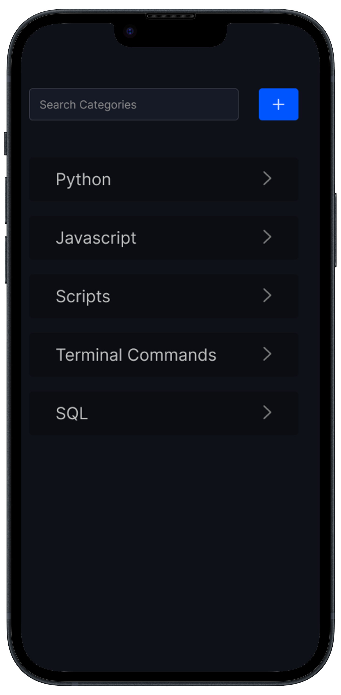

# Savvy Snip

Last Updated: April 21 2024

Welcome to Savvy Snip, your future go-to tool for storing, organizing, and accessing code snippets with ease. Whether you're a seasoned developer or just getting started, Savvy Snip is designed to streamline your workflow and boost your coding efficiency. Say goodbye to repetitive Google searches and hello to a seamless coding experience.

## Table of Contents

- [Introduction](#introduction)
- [Features (MVP)](#features-mvp)
- [Use Cases](#use-cases)
- [Future Developments](#future-developments)
- [Version History](#version-history)
- [Sign Up for the Waitlist](#sign-up-for-the-waitlist)

## Creator
- Harman Sahota
- 10harmansahota@gmail.com

## Introduction

Savvy Snip is a user-friendly application that will help developers store, organize, and retrieve code snippets effortlessly. With features such as powerful search, Markdown formatting, and customizable categories, Savvy Snip empowers you to focus on what matters most – writing great code.

## Features (MVP)

Savvy Snip comes with a range of features to enhance your coding experience:

- **Code Snippet Storage and Organization:** Store your code snippets securely and organize them into custom categories for easy access.
  
- **Powerful Search Functionality:** Instantly find your code snippets using our powerful search feature, saving you time and effort.

- **Collaboration Made Easy:** Share your code snippets effortlessly with colleagues and friends, fostering collaboration and knowledge sharing.

- **Markdown Formatting:** Write and store your code snippets with Markdown formatting, allowing for clear and structured documentation.

- **Dark Mode Interface:** Enjoy coding in low-light conditions with our sleek dark mode interface, reducing eye strain and enhancing focus.

## Use Cases

Savvy Snip caters to a variety of use cases, making it an essential tool for developers across different scenarios:

1. **Project Management:** Easily organize code snippets based on projects, making it simple to reference and reuse code across different tasks.

2. **Learning and Teaching:** Keep track of code examples and solutions to common programming problems, aiding in both personal learning and teaching others.

3. **Collaboration:** Share snippets with team members to facilitate collaboration and streamline development processes.

4. **Documentation:** Use Savvy Snip to create and maintain a repository of code snippets for documentation purposes, ensuring clarity and consistency in your projects.

## Future Developments

Please note that the features mentioned above represent the MVP (Minimum Viable Product) of Savvy Snip. We have exciting plans for future developments, including additional features that will further enhance your coding experience. Stay tuned for updates!

## Version History
| Version | Features |
|---------|----------|
| 1.0.0   | MVP Features: Code snippet storage, powerful search, collaboration, Markdown formatting, dark mode interface. |

### Mockups 1.0.0

#### iPhone Dark Mode

    
    
    

#### iPhone Light Mode

    
    
    

#### Macbook Menu Bar Attachment

## Sign Up for the Waitlist

Interested in trying out Savvy Snip? Sign up for our waitlist to be notified when the app is ready for beta testing! [Join the Waitlist](https://savvysnip.github.io)

